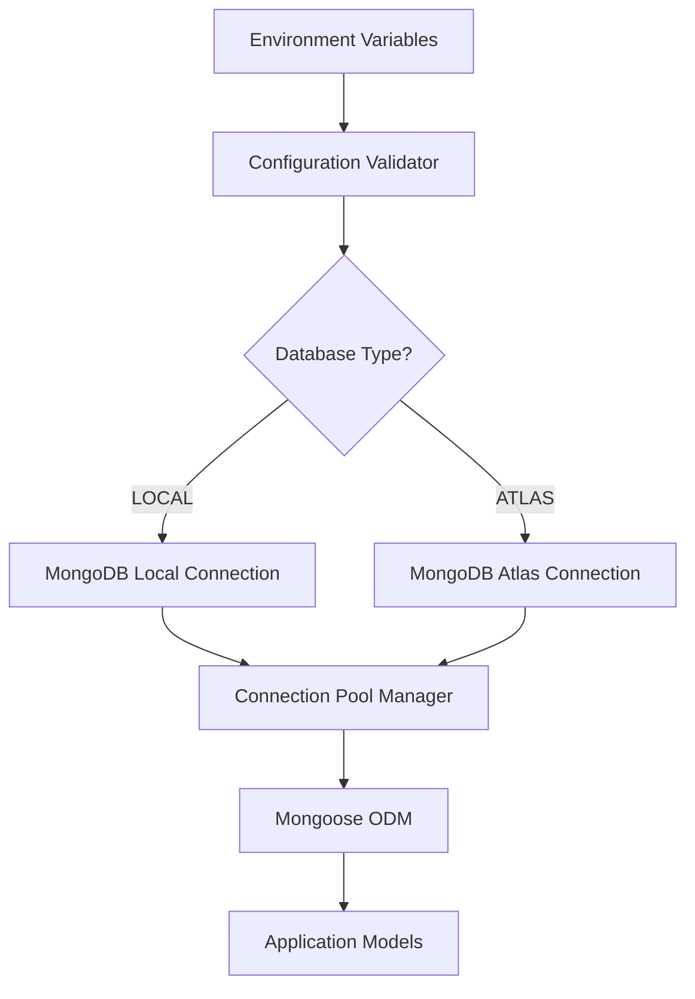
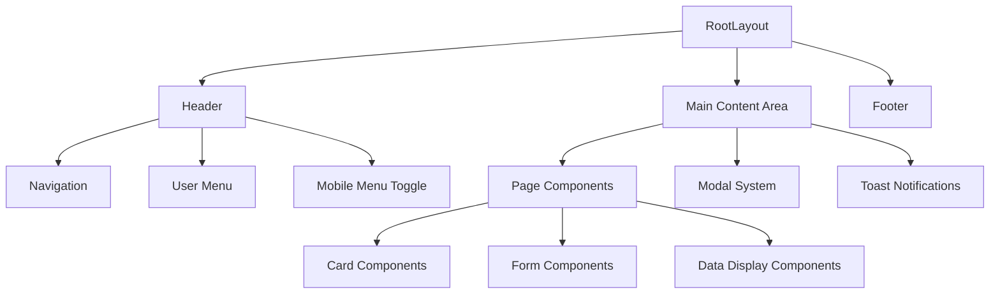
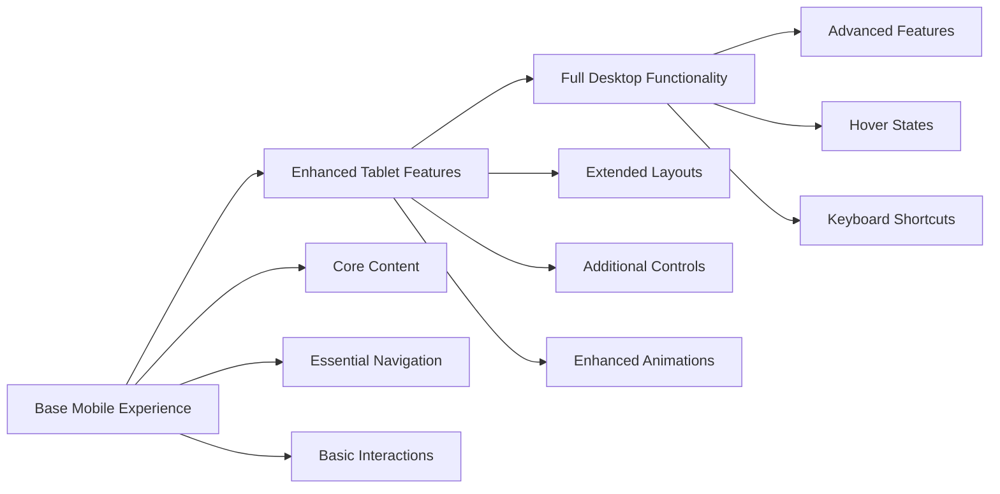

# Next.js MongoDB Configuration Switcher with shadcn/ui & Tailwind CSS

## Overview

A modern Next.js 14 application featuring dynamic MongoDB configuration switching between local and Atlas instances via environment variables. The application implements a mobile-first responsive design using shadcn/ui components and Tailwind CSS, ensuring optimal user experience across all device types.

### Core Features
- **Environment-based MongoDB switching** (localhost ↔ Atlas)
- **Mobile-first responsive design** with breakpoint optimization
- **Modern UI components** using shadcn/ui library
- **Type-safe development** with TypeScript
- **Server-side rendering** with App Router
- **Real-time configuration validation**

## Technology Stack & Dependencies

### Core Framework
- **Next.js 14** - App Router with React Server Components
- **React 18** - Latest features with concurrent rendering
- **TypeScript** - Type safety and developer experience

### Database & Backend
- **MongoDB** - Document database with dual configuration
- **Mongoose** - ODM with schema validation
- **MongoDB Atlas** - Cloud database service
- **Local MongoDB** - Development environment

### UI & Styling
- **Tailwind CSS** - Utility-first CSS framework
- **shadcn/ui** - High-quality accessible components
- **Radix UI** - Unstyled, accessible UI primitives
- **Lucide React** - Beautiful icon library
- **clsx** - Conditional className utility

### Development Tools
- **ESLint** - Code linting and formatting
- **Prettier** - Code formatting
- **Husky** - Git hooks for quality control

## Architecture

### Project Structure
```
src/
├── app/
│   ├── api/
│   │   ├── auth/
│   │   ├── health/
│   │   └── users/
│   ├── globals.css
│   ├── layout.tsx
│   └── page.tsx
├── components/
│   ├── ui/           # shadcn/ui components
│   ├── layout/       # Layout components
│   ├── forms/        # Form components
│   └── common/       # Shared components
├── lib/
│   ├── db/
│   │   ├── connection.ts
│   │   ├── models/
│   │   └── utils.ts
│   ├── utils.ts
│   └── validations/
├── types/
│   ├── database.ts
│   ├── api.ts
│   └── components.ts
└── config/
    ├── database.ts
    ├── environment.ts
    └── constants.ts
```

### Database Configuration Architecture

#### Environment Configuration Manager


#### Connection Strategy
- **Singleton Pattern** - Single database connection per environment
- **Connection Pooling** - Optimized connection management
- **Graceful Fallback** - Automatic retry logic with exponential backoff
- **Health Monitoring** - Real-time connection status tracking

### Component Architecture

#### Component Hierarchy


#### Mobile-First Component Design Principles
1. **Touch-Friendly Interfaces** - Minimum 44px touch targets
2. **Progressive Enhancement** - Mobile → Tablet → Desktop
3. **Flexible Layouts** - CSS Grid and Flexbox integration
4. **Optimized Performance** - Lazy loading and code splitting

## Responsive Design System

### Breakpoint Strategy
```css
/* Mobile First Approach */
/* Base: 320px - 767px (Mobile) */
.container { @apply px-4 max-w-sm mx-auto; }

/* sm: 768px+ (Tablet Portrait) */
@media (min-width: 768px) {
  .container { @apply max-w-md px-6; }
}

/* md: 1024px+ (Tablet Landscape/Small Desktop) */
@media (min-width: 1024px) {
  .container { @apply max-w-4xl px-8; }
}

/* lg: 1280px+ (Desktop) */
@media (min-width: 1280px) {
  .container { @apply max-w-6xl; }
}

/* xl: 1536px+ (Large Desktop) */
@media (min-width: 1536px) {
  .container { @apply max-w-7xl; }
}
```

### Layout Components

#### Responsive Navigation
- **Mobile**: Hamburger menu with slide-out drawer
- **Tablet**: Horizontal navigation with collapsible sections
- **Desktop**: Full horizontal navigation with dropdowns

#### Grid Systems
- **Mobile**: Single column layout with vertical stacking
- **Tablet**: 2-column layouts with flexible content areas
- **Desktop**: Multi-column layouts with sidebar support

## Database Configuration Management

### Environment Variables Schema
```typescript
interface DatabaseConfig {
  DATABASE_TYPE: 'local' | 'atlas'
  
  // Local MongoDB Configuration
  MONGODB_LOCAL_URI: string
  MONGODB_LOCAL_DB_NAME: string
  
  // Atlas Configuration
  MONGODB_ATLAS_URI: string
  MONGODB_ATLAS_DB_NAME: string
  MONGODB_ATLAS_USERNAME: string
  MONGODB_ATLAS_PASSWORD: string
  
  // Connection Settings
  CONNECTION_TIMEOUT: number
  MAX_POOL_SIZE: number
  MIN_POOL_SIZE: number
}
```

### Configuration Validation Flow
```mermaid
sequencer
    participant App as Application
    participant Config as Config Validator
    participant Local as Local MongoDB
    participant Atlas as Atlas MongoDB
    participant Health as Health Monitor
    
    App->>Config: Initialize Database
    Config->>Config: Validate Environment Variables
    
    alt DATABASE_TYPE === 'local'
        Config->>Local: Test Local Connection
        Local-->>Config: Connection Status
    else DATABASE_TYPE === 'atlas'
        Config->>Atlas: Test Atlas Connection
        Atlas-->>Config: Connection Status
    end
    
    Config->>Health: Start Health Monitoring
    Config-->>App: Return Connection Instance
    
    loop Every 30 seconds
        Health->>Local: Ping Health Check
        Health->>Atlas: Ping Health Check
    end
```

### Connection Manager Implementation
- **Environment Detection** - Automatic configuration based on NODE_ENV
- **Connection Caching** - Reuse existing connections across requests
- **Error Recovery** - Automatic reconnection with circuit breaker pattern
- **Monitoring Integration** - Real-time connection metrics

## shadcn/ui Component Integration

### Core Components Library

#### Form Components
- **Input Fields** - Text, email, password with validation states
- **Select Dropdowns** - Single and multi-select with search
- **Checkboxes & Radios** - Custom styled form controls
- **Date Pickers** - Calendar integration with range selection
- **File Uploads** - Drag-and-drop with progress indicators

#### Navigation Components
- **Breadcrumbs** - Hierarchical navigation trails
- **Tabs** - Horizontal and vertical tab layouts
- **Pagination** - Numbered and infinite scroll pagination
- **Navigation Menus** - Multi-level dropdown menus

#### Feedback Components
- **Alerts** - Success, warning, error, and info states
- **Toasts** - Non-blocking notification system
- **Loading States** - Spinners, skeletons, and progress bars
- **Modals** - Overlay dialogs with accessibility features

#### Data Display Components
- **Tables** - Sortable, filterable, and paginated data tables
- **Cards** - Flexible content containers
- **Lists** - Ordered and unordered item displays
- **Badges** - Status indicators and labels

### Component Customization Strategy

#### Theme Configuration
```typescript
interface ThemeConfig {
  colors: {
    primary: { 50: string, 500: string, 900: string }
    secondary: { 50: string, 500: string, 900: string }
    accent: { 50: string, 500: string, 900: string }
    neutral: { 50: string, 500: string, 900: string }
  }
  
  spacing: {
    xs: string, sm: string, md: string, lg: string, xl: string
  }
  
  typography: {
    fontFamily: { sans: string[], mono: string[] }
    fontSize: { xs: string, sm: string, base: string, lg: string, xl: string }
  }
  
  borderRadius: {
    sm: string, md: string, lg: string, xl: string
  }
}
```

#### Responsive Component Variants
- **Mobile Variants** - Optimized for touch interaction
- **Tablet Variants** - Balanced layout for medium screens
- **Desktop Variants** - Full-featured layouts with hover states

## Mobile-First Design Principles

### Performance Optimization
- **Critical CSS Inlining** - Above-the-fold styles loaded immediately
- **Image Optimization** - WebP format with responsive sizing
- **Code Splitting** - Route-based and component-based lazy loading
- **Bundle Analysis** - Webpack bundle analyzer integration

### Touch Interface Design
- **Gesture Support** - Swipe, pinch, and tap interactions
- **Touch Target Sizing** - Minimum 44px × 44px clickable areas
- **Visual Feedback** - Haptic feedback simulation with CSS transitions
- **Accessibility** - Screen reader and keyboard navigation support

### Progressive Enhancement Strategy


## API Design & Data Flow

### RESTful API Structure
```typescript
interface APIEndpoints {
  // Authentication
  'POST /api/auth/login': { email: string, password: string }
  'POST /api/auth/logout': {}
  'GET /api/auth/profile': UserProfile
  
  // Database Health
  'GET /api/health/database': DatabaseStatus
  'POST /api/health/switch': { target: 'local' | 'atlas' }
  
  // User Management
  'GET /api/users': PaginatedUsers
  'POST /api/users': CreateUserPayload
  'PUT /api/users/:id': UpdateUserPayload
  'DELETE /api/users/:id': {}
}
```

### Data Models & Schema Validation

#### User Model Schema
```typescript
interface UserModel {
  _id: ObjectId
  email: string
  name: string
  avatar?: string
  role: 'admin' | 'user' | 'moderator'
  preferences: {
    theme: 'light' | 'dark' | 'system'
    language: string
    notifications: boolean
  }
  createdAt: Date
  updatedAt: Date
}
```

#### Database Connection Model
```typescript
interface ConnectionStatus {
  type: 'local' | 'atlas'
  status: 'connected' | 'disconnected' | 'error'
  latency: number
  lastChecked: Date
  errorMessage?: string
  metadata: {
    host: string
    database: string
    collections: number
  }
}
```

## Testing Strategy

### Unit Testing Framework
- **Jest** - JavaScript testing framework
- **React Testing Library** - Component testing utilities
- **MSW** - API mocking for integration tests
- **Testing Database** - In-memory MongoDB for isolation

### Testing Categories

#### Component Testing
- **Rendering Tests** - Component mount and unmount behavior
- **Interaction Tests** - User event simulation and responses
- **Accessibility Tests** - ARIA attributes and keyboard navigation
- **Responsive Tests** - Viewport-specific rendering validation

#### Database Integration Testing
- **Connection Tests** - Local and Atlas connection validation
- **Schema Tests** - Model validation and constraint testing
- **Migration Tests** - Database version upgrade testing
- **Performance Tests** - Query optimization and load testing

#### End-to-End Testing
- **User Flows** - Complete application workflows
- **Cross-Browser Testing** - Compatibility across modern browsers
- **Mobile Testing** - Touch interaction and responsive behavior
- **Performance Testing** - Core Web Vitals measurement

### Test Coverage Goals
- **Unit Tests**: 90%+ coverage for utilities and components
- **Integration Tests**: 80%+ coverage for API endpoints
- **E2E Tests**: Critical user paths and error scenarios

## Configuration Management

### Environment File Structure
```bash
# .env.local (Development)
DATABASE_TYPE=local
MONGODB_LOCAL_URI=mongodb://localhost:27017
MONGODB_LOCAL_DB_NAME=schooltally_dev

# .env.production (Production)
DATABASE_TYPE=atlas
MONGODB_ATLAS_URI=mongodb+srv://cluster.mongodb.net
MONGODB_ATLAS_DB_NAME=schooltally_prod
MONGODB_ATLAS_USERNAME=prod_user
MONGODB_ATLAS_PASSWORD=secure_password

# Shared Configuration
CONNECTION_TIMEOUT=10000
MAX_POOL_SIZE=10
MIN_POOL_SIZE=2
```

### Runtime Configuration Switching
- **Hot Reload Support** - Configuration changes without restart
- **Validation Middleware** - Real-time environment validation
- **Fallback Mechanisms** - Graceful degradation on connection failure
- **Admin Interface** - GUI for configuration management

## Security Implementation

### Database Security
- **Connection Encryption** - TLS/SSL for all database connections
- **Authentication** - Username/password and certificate-based auth
- **IP Whitelisting** - Restricted access to Atlas clusters
- **Environment Isolation** - Separate credentials per environment

### Application Security
- **CSRF Protection** - Cross-site request forgery prevention
- **Rate Limiting** - API endpoint throttling
- **Input Validation** - Server-side data sanitization
- **XSS Prevention** - Content Security Policy implementation